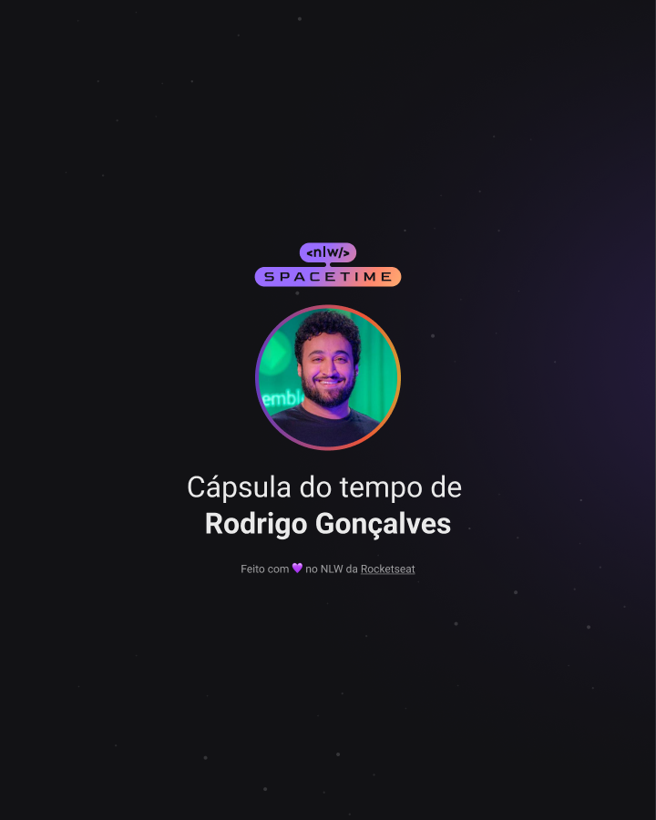

    

## 🖥️Projeto 
Esse é um projeto Web Responsivo de uma cápsula do tempo para exibir memórias em uma timeline.

## 🚀 Tecnologias
Esse proketo foi desenvolvido durante o NLW da Rocketseat com as seguintes tecnologias:
-HTML
-CSS
-Git e Github

## 🏷️layout
Você pode visualizar o layout do projeto atraves 
[desse link](https://www.figma.com/file/hnVrIMRpqSRNx752NOGyBD/C%C3%A1psula-do-tempo-%E2%80%A2-Trilha-Explorer-(Community)?type=design&node-id=306%3A3&t=a84YYyqTNhjOSOLZ-1).
É necessario ter uma conta no [Figma](https://www.figma.com)